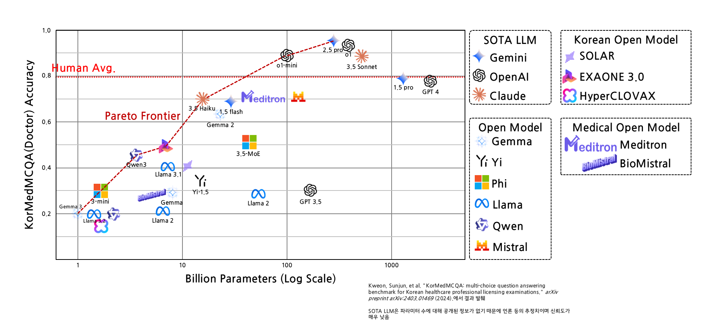

# README



- 하단의 모델 외에는 [KorMedMCQA: Multi-Choice Question Answering Benchmark for Korean Healthcare Professional Licensing Examinations의 Appendix C](https://doi.org/10.48550/arXiv.2403.01469)에서 가져옴
- Closed Model의 파라미터는 추정 값

## 참고 문헌 및 자료

- [Kweon, S., Choi, B., Chu, G., Song, J., Hyeon, D., Gan, S., ... & Choi, E. (2024). KorMedMCQA: multi-choice question answering benchmark for Korean healthcare professional licensing examinations. arXiv preprint arXiv:2403.01469.](https://doi.org/10.48550/arXiv.2403.01469)

### 데이터셋
- 영어, 한국어 데이터셋으로 sLLM 진단 결과 측정
- 영어: 미국 의사 면허 시험(USMLE)을 기반으로 한 12,000여 개의 문제로 구성
- 한국어: KorMedMCQA 등을 기반으로 7,469개의 문제로 구성

## 옵션별 실험환경

- 전체 DeepSpeed ZeRO 사용
- attn_implementation은 flash_attention_2 사용
- pre-trained 모델이 입력을 그대로 출력하는 경향 때문에 do_sample을 False로 설정하고 repeatition_penalty를 1.5로 줌
- tokenizer는 `max_length=3500`, `truncation=True`

### baseline(no finetuning/no quantization)

- finetuning, quantization(BitsAndBytes/AWQ), LoRA, CoT 등을 조합하면서 테스팅
  - finetuning은 full finetuning을 가리킴
  - BitsAndBytes는 사후 양자화, LoRA도 같이 활성화된다면 QLoRA 방식
  - AWQ는 훈련 중 양자화로 huggingface에서 공식적으로 업로드된 모델은 다음과 같음
    - EXAONE3.5 전체 파라미터, Gemma3 전체 파라미터(QAT 모델), Qwen3 전체 파라미터, Qwen2.5 전체 파라미터
  - CoT는 KorMedMCQA에 한함, cot를 위한 5-shot 데이터가 따로 있음

#### Gemma3 1B

```python
training_args = TrainingArguments(
    output_dir=output_dir,  
    per_device_train_batch_size=kwargs.get("train_batch_size", 8),
    per_device_eval_batch_size=kwargs.get("eval_batch_size", 8),
    num_train_epochs=kwargs.get("num_train_epochs", 3),
    logging_dir=f"{output_dir}/logs",
    logging_steps=kwargs.get("logging_steps", 10),
    save_steps=kwargs.get("save_steps", 500),
    eval_strategy="steps",
    eval_steps=kwargs.get("eval_steps", 500),
    save_total_limit=kwargs.get("save_total_limit", 2),
    deepspeed="deepspeed_config.json"
)
```

### BitsAndBytes Quantization

- 모델 로딩 후 BitsAndBytes 인스턴스를 통해 하이퍼 파라미터를 다음과 같이 설정

|hyperparameter|value|
|:--|:--|
|load_in_4bit|True|
|bnb_4bit_use_double_quant|True|
|bnb_4bit_quant_type|nf4|
|bnb_4bit_compute_dtype|bloat16|

### lora(r=32/a=64)

### qlora(r=32/a=64)
